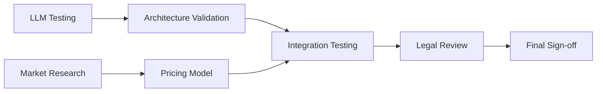

# Testing Protocol 1: Research & Validation Phase - Comprehensive Framework

## Executive Summary
This document establishes comprehensive testing procedures, validation methodologies, and quality assurance metrics for the Research & Validation Phase of the AI Ebook Generation Platform. All deliverables must pass these quality gates before proceeding to Phase 2.

---

## 1. LLM Performance Testing Validation Framework

### 1.1 Test Environment Setup
**Objective**: Validate LLM API configurations and baseline performance

#### Pre-Test Requirements
- [ ] API keys secured and environment variables configured
- [ ] Rate limiting parameters documented
- [ ] Cost tracking mechanisms in place
- [ ] Error handling and retry logic implemented
- [ ] Response time monitoring active

#### Validation Checklist
```
✓ Claude API (Anthropic) connectivity verified
✓ GPT-4 API (OpenAI) connectivity verified
✓ API response time < 30 seconds for standard prompts
✓ Error rate < 1% for API calls
✓ Cost tracking accuracy verified with test transactions
```

### 1.2 Content Generation Testing Protocol

#### Test Cases Matrix

| Test ID | Genre | Word Count | Model | Success Criteria |
|---------|-------|------------|-------|------------------|
| LLM-001 | Mystery | 5,000 | Claude | Coherent plot, consistent characters |
| LLM-002 | Mystery | 7,000 | GPT-4 | Maintains tension, logical resolution |
| LLM-003 | Self-Help | 5,000 | Claude | Clear structure, actionable advice |
| LLM-004 | Self-Help | 7,000 | GPT-4 | Professional tone, practical examples |
| LLM-005 | Romance | 6,000 | Both | Character development, emotional depth |
| LLM-006 | Sci-Fi | 6,500 | Both | World-building consistency, tech accuracy |

#### Quality Metrics
1. **Coherence Score** (1-10)
   - Plot consistency
   - Character development
   - Narrative flow
   - Genre adherence

2. **Technical Metrics**
   - Token usage per 1,000 words
   - Generation time per chapter
   - Cost per 10,000 words
   - Error recovery success rate

3. **Instruction Following** (Pass/Fail)
   - Word count accuracy (±5%)
   - Style guide compliance
   - Formatting requirements
   - Content restrictions adherence

### 1.3 Comparative Analysis Framework

#### Performance Comparison Matrix
```
Metric               | Claude | GPT-4 | Threshold
---------------------|--------|-------|----------
Avg Generation Time  |        |       | < 45 sec
Cost per 10k words   |        |       | < $5.00
Quality Score (1-10) |        |       | > 7.5
Consistency Rate     |        |       | > 85%
Error Rate           |        |       | < 2%
```

#### A/B Testing Protocol
1. Generate identical prompts for both models
2. Blind quality assessment by 3 reviewers
3. Statistical significance testing (p < 0.05)
4. Cost-benefit analysis documentation
5. Recommendation report generation

---

## 2. Market Research & Competitive Analysis Verification

### 2.1 Competitive Analysis Validation Framework

#### Competitor Feature Matrix Testing
| Feature | Jasper | Copy.ai | Sudowrite | Our Platform | Validation Method |
|---------|--------|---------|-----------|--------------|-------------------|
| Long-form content | ✓/✗ | ✓/✗ | ✓/✗ | Required | Feature comparison test |
| Genre specialization | ✓/✗ | ✓/✗ | ✓/✗ | Required | Output quality assessment |
| Humanization tools | ✓/✗ | ✓/✗ | ✓/✗ | Required | AI detection bypass test |
| Publishing integration | ✓/✗ | ✓/✗ | ✓/✗ | Required | API availability check |
| Pricing competitiveness | $ | $ | $ | $ | Market positioning analysis |

#### Validation Procedures
1. **Feature Parity Testing**
   - [ ] Create test accounts on all competitor platforms
   - [ ] Document feature availability and limitations
   - [ ] Test output quality for identical prompts
   - [ ] Measure time-to-completion for standard tasks
   - [ ] Calculate total cost of ownership

2. **Market Gap Analysis**
   - [ ] Identify unmet needs through user interviews (minimum 20)
   - [ ] Validate pain points with survey data (minimum 100 responses)
   - [ ] Confirm differentiating features value proposition
   - [ ] Test unique selling points with focus groups

### 2.2 User Research Validation

#### Survey Validation Criteria
- Minimum sample size: 150 respondents
- Target demographic accuracy: 80% match
- Response completion rate: > 70%
- Statistical significance: 95% confidence level
- Geographic distribution: 3+ countries

#### Interview Protocol Validation
```
Pre-Interview Checklist:
✓ Interview guide reviewed and approved
✓ Recording equipment tested
✓ Consent forms prepared
✓ Compensation structure defined
✓ Data analysis framework ready

Quality Metrics:
- Interview duration: 30-45 minutes
- Open-ended question ratio: > 60%
- Actionable insights per interview: > 5
- Theme saturation point: 15-20 interviews
```

### 2.3 Pricing Model Validation

#### Testing Framework
1. **Price Sensitivity Analysis**
   - Van Westendorp Price Sensitivity Meter
   - Conjoint analysis for feature-price trade-offs
   - Competitive pricing benchmarking
   - Willingness-to-pay surveys

2. **Revenue Model Testing**
   - Subscription tier acceptance rates
   - Hybrid model (upfront + revenue share) viability
   - Conversion rate projections
   - Customer lifetime value calculations

#### Success Criteria
- Price point acceptance: > 60% of target users
- Projected conversion rate: > 2.5%
- CAC:LTV ratio: < 1:3
- Break-even timeline: < 18 months

---

## 3. Technical Architecture Validation

### 3.1 System Requirements Validation

#### Performance Requirements Testing
```yaml
Load Testing Scenarios:
  - Concurrent Users: [100, 500, 1000, 5000]
  - Response Time Target: < 2 seconds (95th percentile)
  - Error Rate Threshold: < 0.1%
  - Database Query Time: < 100ms
  - API Gateway Throughput: > 10,000 req/min
```

#### Scalability Testing Protocol
1. **Vertical Scaling Tests**
   - Resource utilization at 50%, 75%, 90% capacity
   - Performance degradation curves
   - Auto-scaling trigger validation
   - Cost implications documentation

2. **Horizontal Scaling Tests**
   - Load balancer effectiveness
   - Session persistence validation
   - Data consistency across nodes
   - Geographic distribution testing

### 3.2 Technology Stack Validation

#### Frontend Framework Testing
| Criteria | React | Next.js | Vue | Angular | Score |
|----------|--------|---------|-----|---------|-------|
| Performance (Lighthouse) | /100 | /100 | /100 | /100 | |
| Bundle Size | KB | KB | KB | KB | |
| SEO Capabilities | 1-10 | 1-10 | 1-10 | 1-10 | |
| Developer Experience | 1-10 | 1-10 | 1-10 | 1-10 | |
| Community Support | 1-10 | 1-10 | 1-10 | 1-10 | |

#### Backend Technology Validation
```javascript
// Performance Benchmarks
const benchmarks = {
  nodejs: {
    requestsPerSecond: null, // Target: > 5000
    memoryUsage: null,      // Target: < 512MB idle
    cpuUtilization: null,   // Target: < 30% idle
    startupTime: null       // Target: < 5 seconds
  },
  python: {
    requestsPerSecond: null, // Target: > 3000
    memoryUsage: null,      // Target: < 256MB idle
    cpuUtilization: null,   // Target: < 25% idle
    startupTime: null       // Target: < 10 seconds
  }
};
```

### 3.3 Database Schema Validation

#### Data Model Testing
1. **Normalization Validation**
   - [ ] No redundant data storage
   - [ ] Referential integrity maintained
   - [ ] Index optimization completed
   - [ ] Query performance validated

2. **Migration Testing**
   - [ ] Forward migration success
   - [ ] Rollback procedures verified
   - [ ] Data integrity maintained
   - [ ] Zero-downtime deployment possible

#### Performance Benchmarks
```sql
-- Query Performance Targets
-- User lookup: < 10ms
-- Project retrieval: < 50ms
-- Chapter save: < 100ms
-- Full book export: < 5 seconds
-- Analytics aggregation: < 1 second
```

### 3.4 Security Architecture Validation

#### Security Testing Checklist
- [ ] **Authentication & Authorization**
  - JWT token validation
  - Session management security
  - Role-based access control
  - Multi-factor authentication ready

- [ ] **Data Protection**
  - Encryption at rest (AES-256)
  - Encryption in transit (TLS 1.3)
  - PII data masking
  - Secure key management

- [ ] **API Security**
  - Rate limiting implementation
  - DDoS protection
  - Input validation
  - SQL injection prevention
  - XSS protection

- [ ] **Compliance Readiness**
  - GDPR compliance checklist
  - CCPA requirements met
  - PCI DSS ready (for payments)
  - SOC 2 Type I preparation

---

## 4. Legal Framework Compliance Testing

### 4.1 Content Ownership Validation

#### Legal Review Checklist
```
Document Review Status:
✓ AI-generated content ownership rights clarified
✓ User content license agreements drafted
✓ Third-party content usage policies defined
✓ Copyright infringement procedures established
✓ DMCA compliance framework ready
```

#### Testing Procedures
1. **Ownership Transfer Testing**
   - User retains full rights scenario
   - Platform licensing scenario
   - Shared ownership model
   - Revenue sharing implications

2. **Legal Precedent Analysis**
   - Review 10+ similar platform terms
   - Identify industry standards
   - Risk assessment completion
   - Legal counsel approval

### 4.2 Payment Processing Compliance

#### Compliance Validation Matrix
| Requirement | Status | Test Method | Evidence |
|-------------|--------|-------------|----------|
| PCI DSS Compliance | Pass/Fail | Security audit | Certificate |
| Tax Calculation | Pass/Fail | Multi-region test | Test results |
| Refund Processing | Pass/Fail | Transaction test | Process doc |
| Chargeback Handling | Pass/Fail | Simulation | Procedure doc |
| International Payments | Pass/Fail | Currency test | Test report |

### 4.3 Data Privacy Compliance Testing

#### GDPR Compliance Checklist
- [ ] **User Rights Implementation**
  - Right to access (data export)
  - Right to rectification (data editing)
  - Right to erasure (account deletion)
  - Right to portability (data transfer)
  - Right to object (opt-out mechanisms)

- [ ] **Privacy by Design**
  - Data minimization verified
  - Purpose limitation enforced
  - Storage limitation implemented
  - Security measures validated

#### Testing Protocol
1. Execute full user data lifecycle test
2. Validate consent management flows
3. Test data breach notification procedures
4. Verify cross-border data transfer compliance
5. Audit third-party processor agreements

### 4.4 Terms of Service Validation

#### Review Criteria
- Clarity score (Flesch reading ease > 60)
- Completeness (all scenarios covered)
- Enforceability (legal review passed)
- User acceptance testing (> 80% comprehension)
- Dispute resolution procedures defined

---

## 5. End-to-End Integration Testing

### 5.1 Complete User Journey Testing

#### Test Scenarios
1. **New User Onboarding**
   ```
   Steps:
   1. Landing page arrival
   2. Sign-up process
   3. Email verification
   4. Assessment completion
   5. First project creation
   
   Success Metrics:
   - Completion rate > 70%
   - Time to first project < 10 minutes
   - Zero critical errors
   - Help requests < 5%
   ```

2. **Book Creation Workflow**
   ```
   Steps:
   1. Project initialization
   2. Genre selection
   3. Outline generation
   4. Chapter creation
   5. Editing and refinement
   6. Export and download
   
   Success Metrics:
   - Full book completion < 2 hours
   - User satisfaction > 8/10
   - Quality score > 7.5/10
   - Technical errors < 1%
   ```

### 5.2 Cross-Component Integration

#### Integration Points Testing
| Component A | Component B | Test Focus | Status |
|-------------|-------------|------------|--------|
| Frontend | Backend API | Data synchronization | ⏳ |
| Backend | LLM APIs | Request/response handling | ⏳ |
| Database | Cache Layer | Consistency validation | ⏳ |
| Payment | User Management | Subscription sync | ⏳ |
| Analytics | All Components | Event tracking | ⏳ |

### 5.3 Failure Recovery Testing

#### Chaos Engineering Scenarios
1. **API Failures**
   - LLM API timeout handling
   - Payment gateway failure
   - Database connection loss
   - Cache invalidation issues

2. **Data Integrity Tests**
   - Concurrent edit conflicts
   - Partial save recovery
   - Backup restoration
   - Version control conflicts

---

## 6. Quality Metrics & Success Criteria

### 6.1 Key Performance Indicators (KPIs)

#### Technical KPIs
```yaml
Performance:
  API_Response_Time: < 200ms (p95)
  Page_Load_Time: < 2s
  Time_to_Interactive: < 3s
  Error_Rate: < 0.1%
  Uptime: > 99.9%

Quality:
  Code_Coverage: > 80%
  Bug_Density: < 5 per KLOC
  Security_Vulnerabilities: 0 critical, < 3 medium
  Technical_Debt_Ratio: < 5%

User_Experience:
  Task_Completion_Rate: > 90%
  User_Error_Rate: < 5%
  Support_Ticket_Rate: < 2%
  User_Satisfaction: > 4.5/5
```

### 6.2 Acceptance Criteria

#### Phase 1 Exit Criteria
All items must be checked for phase completion:

- [ ] All LLM performance tests passed with > 80% success rate
- [ ] Market research validated with statistical significance
- [ ] Technical architecture approved by engineering team
- [ ] Legal framework reviewed and approved by counsel
- [ ] Security audit passed with no critical issues
- [ ] Cost projections within 10% of budget
- [ ] Risk assessment completed and mitigation plans in place
- [ ] Stakeholder sign-off obtained

### 6.3 Quality Gate Review Process

#### Review Board Composition
- Technical Lead (Full-Stack Developer)
- Product Owner
- Legal Advisor
- Security Officer
- QA Lead

#### Review Checklist
```
Pre-Review Requirements:
✓ All test reports compiled
✓ Metrics dashboard updated
✓ Risk register current
✓ Budget analysis complete
✓ Timeline assessment done

Review Meeting Agenda:
1. Test results presentation (30 min)
2. Risk and issue discussion (20 min)
3. Budget and timeline review (15 min)
4. Go/No-Go decision (15 min)
5. Action items and next steps (10 min)
```

---

## 7. Testing Tools & Infrastructure

### 7.1 Required Testing Tools

#### Performance Testing
- **Load Testing**: K6, JMeter, or Gatling
- **API Testing**: Postman, Insomnia
- **Browser Testing**: Selenium, Cypress
- **Mobile Testing**: BrowserStack, Sauce Labs

#### Quality Assurance
- **Code Quality**: SonarQube, ESLint, Prettier
- **Security Testing**: OWASP ZAP, Burp Suite
- **Accessibility**: axe DevTools, WAVE
- **Performance**: Lighthouse, WebPageTest

### 7.2 Testing Environment Setup

```yaml
Environments:
  Development:
    Purpose: Initial testing and debugging
    Data: Synthetic test data
    Access: Development team only
    
  Staging:
    Purpose: Integration and UAT
    Data: Production-like dataset
    Access: QA team and stakeholders
    
  Performance:
    Purpose: Load and stress testing
    Data: Large-scale synthetic data
    Access: Performance testing team
```

### 7.3 Test Data Management

#### Data Requirements
- User profiles: 1,000 synthetic users
- Book projects: 500 sample projects
- Content samples: 100 chapters per genre
- Transaction data: 10,000 test transactions
- Analytics events: 1M synthetic events

---

## 8. Risk Assessment & Mitigation

### 8.1 Technical Risks

| Risk | Probability | Impact | Mitigation | Test Coverage |
|------|------------|--------|------------|---------------|
| LLM API rate limits | High | High | Multiple provider fallback | Load testing |
| Cost overruns | Medium | High | Usage monitoring & caps | Cost tracking tests |
| Scaling issues | Medium | High | Auto-scaling implementation | Performance testing |
| Security breach | Low | Critical | Security audit & monitoring | Penetration testing |
| Data loss | Low | High | Backup & recovery systems | Disaster recovery tests |

### 8.2 Business Risks

| Risk | Probability | Impact | Mitigation | Validation |
|------|------------|--------|------------|------------|
| Low user adoption | Medium | High | MVP user testing | User research validation |
| Competitor response | High | Medium | Differentiation strategy | Competitive analysis |
| Regulatory changes | Low | High | Legal monitoring | Compliance testing |
| Market saturation | Medium | Medium | Niche targeting | Market research |

---

## 9. Reporting & Documentation

### 9.1 Test Report Template

```markdown
# Test Report: [Component/Feature Name]
Date: [YYYY-MM-DD]
Version: [X.Y.Z]
Tester: [Name]

## Executive Summary
[Brief overview of testing performed and results]

## Test Coverage
- Test Cases Executed: X/Y
- Pass Rate: X%
- Critical Issues: X
- Medium Issues: X
- Low Issues: X

## Detailed Results
[Test case results table]

## Issues Found
[Detailed issue descriptions with severity]

## Recommendations
[Next steps and improvement suggestions]

## Sign-off
- QA Lead: [Name] [Date]
- Dev Lead: [Name] [Date]
- Product Owner: [Name] [Date]
```

### 9.2 Continuous Improvement Process

#### Feedback Loop Implementation
1. Weekly test retrospectives
2. Bi-weekly process improvements
3. Monthly metrics review
4. Quarterly strategy alignment

#### Knowledge Management
- Test case repository maintenance
- Lessons learned documentation
- Best practices guide updates
- Team training sessions

---

## 10. Timeline & Milestones

### 10.1 Testing Schedule

```
Week 1-2: LLM Performance Testing
- API setup and configuration
- Test case execution
- Performance benchmarking
- Cost analysis

Week 3-4: Market Research Validation
- Survey deployment
- Interview completion
- Competitive analysis
- Pricing validation

Week 5-6: Technical Architecture Testing
- Load testing
- Security audit
- Database performance
- Integration testing

Week 7: Legal Compliance Review
- Documentation review
- Compliance validation
- Risk assessment
- Legal sign-off

Week 8: Final Integration & Sign-off
- End-to-end testing
- Quality gate review
- Stakeholder approval
- Phase 2 planning
```

### 10.2 Critical Path Dependencies



---

## Appendices

### A. Test Case Templates
[Detailed templates for each test type]

### B. Defect Classification Guide
[Severity and priority definitions]

### C. Tool Configuration Guides
[Setup instructions for testing tools]

### D. Compliance Checklists
[Detailed regulatory requirements]

### E. Vendor Evaluation Criteria
[Third-party service assessment framework]

---

## Document Control

- **Version**: 1.0
- **Created**: 2025-01-14
- **Last Updated**: 2025-01-14
- **Owner**: Full-Stack Developer
- **Review Cycle**: Weekly during Phase 1
- **Distribution**: All Section 1 Team Members

## Approval Sign-offs

| Role | Name | Signature | Date |
|------|------|-----------|------|
| Full-Stack Developer | | | |
| Product Owner | | | |
| QA Lead | | | |
| Legal Advisor | | | |
| Technical Architect | | | |